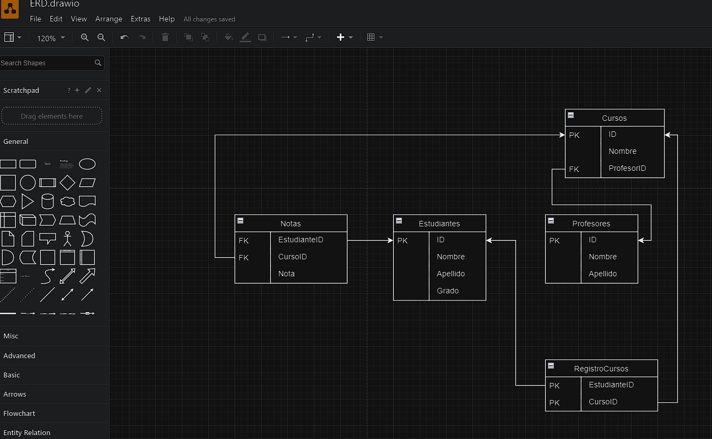

# DB TEACHING PATH



Herramienta ERD: [draw.io](https://app.diagrams.net/)

Este model ERD tiene 3 entidades principales, Profesor, Estudiante y Curso

Hay 2 tablas auxiliares, Notas y RegistroCursos la cual tiene una PRIMARY KEY compuesta (EstudianteID y CursoID)

Este es el script sql equivalente a este diagrama ERD

```sql
CREATE TABLE Estudiantes (
    ID INT PRIMARY KEY,
    Nombre VARCHAR(100),
    Apellido VARCHAR(100),
    Grado INT
);

CREATE TABLE Profesores (
    ID INT PRIMARY KEY,
    Nombre VARCHAR(100),
    Apellido VARCHAR(100)
);

CREATE TABLE Cursos (
    ID INT PRIMARY KEY,
    Nombre VARCHAR(100),
    ProfesorID INT,
    FOREIGN KEY (ProfesorID) REFERENCES Profesores(ID)
);

CREATE TABLE RegistroCursos (
    EstudianteID INT,
    CursoID INT,
    FOREIGN KEY (EstudianteID) REFERENCES Estudiantes(ID),
    FOREIGN KEY (CursoID) REFERENCES Cursos(ID),
    PRIMARY KEY (EstudianteID, CursoID)
);

CREATE TABLE Notas (
    EstudianteID INT,
    CursoID INT,
    Nota DECIMAL(5,2),
    FOREIGN KEY (EstudianteID) REFERENCES Estudiantes(ID),
    FOREIGN KEY (CursoID) REFERENCES Cursos(ID)
);
```
